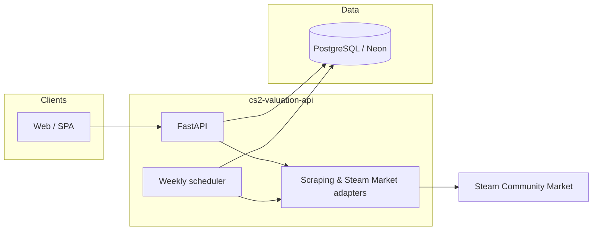
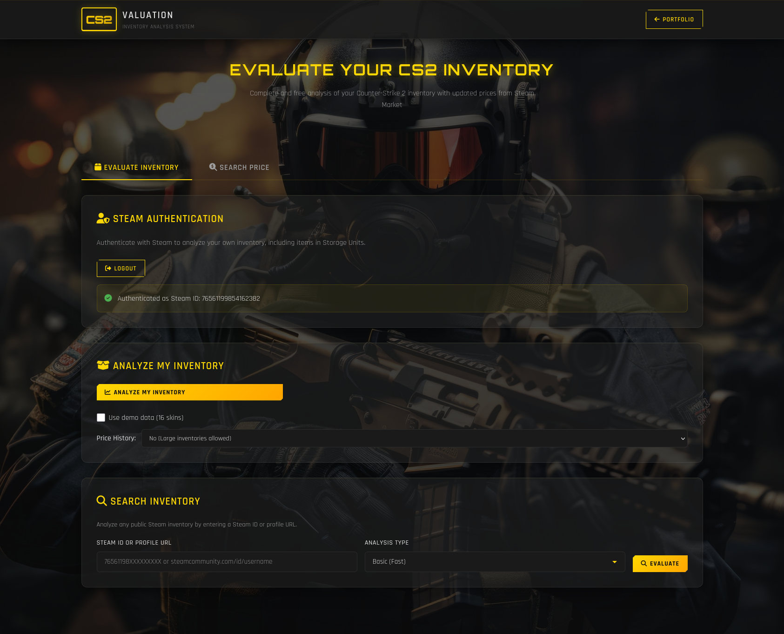

<!-- Canonical repository: https://github.com/sidnei-almeida/cs2-valuation-api -->
<p align="center">
  
</p>

<h1 align="center">cs2-valuation-api</h1>

<p align="center">
  <strong>FastAPI service for Counter-Strike 2 skin valuation: Steam Market–backed prices with wear and StatTrak, batch inventory analysis, and optional PostgreSQL caching with scheduled refreshes.</strong>
</p>

<p align="center">
  <a href="https://fastapi.tiangolo.com/" title="FastAPI"></a>
  &nbsp;&nbsp;&nbsp;
  <a href="https://www.python.org/" title="Python"></a>
  &nbsp;&nbsp;&nbsp;
  <a href="https://www.postgresql.org/" title="PostgreSQL"></a>
  &nbsp;&nbsp;&nbsp;
  <a href="https://store.steampowered.com/" title="Steam"></a>
</p>

<p align="center">
  
  
  
  
</p>

<p align="center">
  <a href="#overview">Overview</a> ·
  <a href="#architecture">Architecture</a> ·
  <a href="#gallery">Gallery</a> ·
  <a href="#features">Features</a> ·
  <a href="#requirements">Requirements</a> ·
  <a href="#installation-and-quick-start">Quick start</a> ·
  <a href="#environment-variables">Environment</a> ·
  <a href="#api-reference">API</a> ·
  <a href="#deployment">Deploy</a> ·
  <a href="#project-layout">Layout</a> ·
  <a href="#author">Author</a>
</p>

---

## Overview

**cs2-valuation-api** exposes JSON endpoints consumed by static frontends (e.g. GitHub Pages). It scrapes and normalizes **Steam Market** pricing, supports **per-exterior** and **StatTrak** lookups, and can **analyze many line items in one request**. PostgreSQL (commonly **Neon**) stores cache metadata; a background **scheduler** can run weekly price maintenance after startup.

> **Scope:** This README describes the **pricing / inventory API** in `main.py`. Optional **Steam OpenID** helpers under `auth/` are not mounted as routes in the current application entrypoint—integrate them if you add authenticated flows.

---

## Architecture



---

## Gallery

README visuals live under **`images/`**:

| File | Use |
|------|-----|
| `images/header.png` | Hero banner (referenced above). |
| `images/software.png` | Gallery: UI, Swagger, or request–response example. |

<p align="center">
  
</p>

<p align="center">
  <em><strong>Figure 1.</strong> Overview capture; update <code>images/software.png</code> when you refresh the UI.</em>
</p>

---

## Features

| Area | Description |
|------|-------------|
| **Granular pricing** | `market_hash_name` + **exterior** (FN, MW, FT, WW, BS) + **StatTrak** flag. |
| **Batch analysis** | `POST /api/inventory/analyze-items` for many items in one payload. |
| **Market overview** | `GET /price/{market_hash_name}` with rich metadata when the scraper returns it. |
| **Cases** | `GET /cases`, `GET /case/{case_name}` backed by `data/cases.json` and live prices. |
| **Resilience** | Broad **CORS** profile for static hosting; global handlers keep CORS headers on errors. |
| **Ops** | `GET /healthcheck`, `GET /api/status`; **Gunicorn + UvicornWorker** for production. |

---

## Requirements

| Component | Notes |
|-----------|--------|
| **Python** | **3.11** (matches `render.yaml` / Docker). |
| **Database** | PostgreSQL URL via **`DATABASE_URL`** for full cache behaviour (`psycopg2-binary`). |
| **Network** | Reachability of Steam / scraping targets used in `services/` and `utils/`. |

Install deps:

```bash
pip install -r requirements.txt
```

---

## Installation and quick start

```bash
git clone https://github.com/sidnei-almeida/cs2-valuation-api.git
cd cs2-valuation-api
python -m venv .venv
source .venv/bin/activate   # Windows: .venv\Scripts\activate
pip install -r requirements.txt
cp .env.example .env        # or env.example — edit secrets locally, never commit
uvicorn main:app --reload --host 0.0.0.0 --port 8080
```

Open **`http://127.0.0.1:8080/docs`**.

> **`PORT`:** `main.py` defaults to **8080** when run directly; **Render** and `render.yaml` inject **`PORT`** automatically.

---

## Environment variables

| Variable | Purpose |
|----------|---------|
| **`DATABASE_URL`** | PostgreSQL connection string (SSL recommended for Neon). |
| **`STEAM_API_KEY`** | Optional, if you extend Steam Web API usage. |
| **`JWT_SECRET_KEY`** | Optional signing secret for future JWT flows. |
| **`RENDER`** | Detected at startup for environment hints. |

Copy from **`.env.example`** / **`env.example`** and fill values **only on your machine or in the host dashboard**—do not commit secrets. Rotate any credentials that were ever committed to git.

---

## API reference

| Method | Path | Description |
|--------|------|-------------|
| `GET` | `/` | Service description and endpoint list. |
| `GET` | `/api/inventory/item-price` | Query: `market_hash_name`, `exterior`, `stattrack` — single item price (USD / metadata). |
| `POST` | `/api/inventory/analyze-items` | JSON body: batch inventory analysis. |
| `GET` | `/price/{market_hash_name}` | Aggregated item pricing and detail fields when available. |
| `GET` | `/cases` | All cases with current price fields. |
| `GET` | `/case/{case_name}` | Single case metadata. |
| `GET` | `/api/status` | Online / version / timestamp. |
| `GET` | `/healthcheck` | Plain-text liveness (**OK** or warming message). |

Full schemas: **`/docs`** (OpenAPI).

**Example**

```bash
curl -s "http://127.0.0.1:8080/api/inventory/item-price?market_hash_name=AK-47%20%7C%20Redline%20(Field-Tested)&exterior=Field-Tested&stattrack=false"
```

---

## Deployment

| Target | Entry |
|--------|--------|
| **Render** | `render.yaml` — `gunicorn` with `uvicorn.workers.UvicornWorker`, bind `0.0.0.0:$PORT`. |
| **Heroku-style** | `Procfile` mirrors the same Gunicorn command. |
| **Docker** | `Dockerfile` in repo root. |

Set **`DATABASE_URL`** in the provider’s secret store. See **`RENDER_DEPLOY.md`** and **`NEON_DATABASE.md`** for extended notes.

---

## Project layout

```
cs2-valuation-api/
├── main.py                 # FastAPI app, CORS, routes, startup
├── requirements.txt
├── Dockerfile
├── render.yaml
├── Procfile
├── railway.toml
├── env.example / .env.example   # Template — do not commit real secrets
├── auth/steam_auth.py          # Optional Steam auth helpers (not wired in main by default)
├── services/                   # Steam market, inventory pricing, cases
├── utils/                      # DB, scraper, migrations, price updater
├── models/
├── data/cases.json
├── images/                     # README (header.png, software.png); optional sample JPGs for /samples
└── notebooks/                  # If present — exploratory workflows
```

---

## Troubleshooting

| Symptom | What to check |
|---------|----------------|
| **DB errors on startup** | Valid **`DATABASE_URL`**, SSL mode, Neon project awake. API may still start with limited features. |
| **Scraper empty / 404** | Steam item spelling, exterior string, StatTrak vs normal variant. |
| **CORS in browser** | Origin must be allowed or use `*` (already in list for dev); preflight cached 24h. |
| **Slow batch** | Large payloads; Gunicorn timeout **120s** in `render.yaml`/Procfile. |

---

## Author

| | |
| --- | --- |
| **Maintainer** | [Sidnei Almeida](https://github.com/sidnei-almeida) |
| **Repository** | [github.com/sidnei-almeida/cs2-valuation-api](https://github.com/sidnei-almeida/cs2-valuation-api) |

---

## License

Specify in **`LICENSE`** if you add one; default intent is often MIT—confirm before redistribution.

---

<p align="center">
  <sub>Counter-Strike and Steam are trademarks of their respective owners; this project is an independent tool.</sub>
</p>
